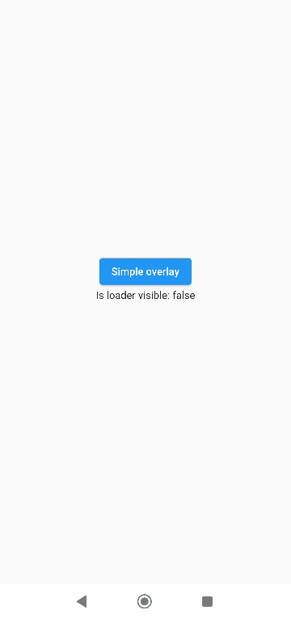
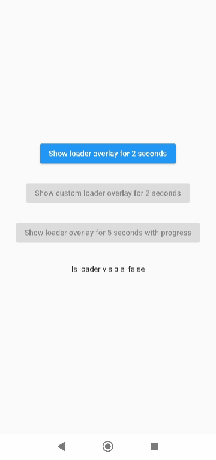
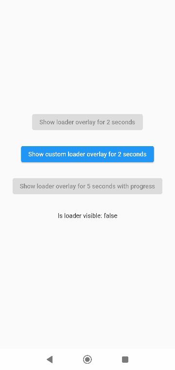
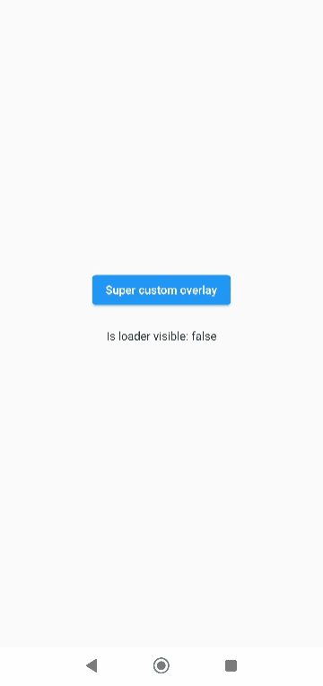

<a href="https://www.buymeacoffee.com/rodrigobastosv" target="_blank"></a>

# Introduction

Have you ever found yourself in the situation of doing some async processing your screen and wanting
to prevent the user from interacting with the screen while the application is loading? If so, this
package was made just for you.

# Basic Usage

The most simple usage is just wrap the widget that you want an overlay on LoaderOverlay. Default
loader will be shown.

```dart
class MyApp extends StatelessWidget {
  @override
  Widget build(BuildContext context) {
    return MaterialApp(
      title: 'Flutter Demo',
      theme: ThemeData(
        primarySwatch: Colors.blue,
      ),
      home: LoaderOverlay(
        child: MyHomePage(title: 'Flutter Demo Home Page'),
      ),
    );
  }
}
```

This simple step will already configure the loader overlay for use.

After that configuration you can just call:

```dart
context.loaderOverlay.show();
```

This will show the overlay with the default loading indicator. The default loading configured is to
just show a centered CircularProgressIndicator

To hide the overlay (after the async processing, for example), just call:

```dart
context.loaderOverlay.hide();
```

You can check if overlay is visible:

```dart

final isVisible = context.loaderOverlay.visible;
```

*Note: You will always need the context to show or hide the loader overlay



# Basic Usage on Named Routes

To use this package with named routes you can just wrap your MaterialApp with GlobalLoaderOverlay.
This widget has all the features of LoaderOverlay but it is provided for all the routes of the app.

```dart
@override
Widget build(BuildContext context) {
  return GlobalLoaderOverlay(
    child: MaterialApp(
      debugShowCheckedModeBanner: false,
      title: 'Flutter Demo',
      theme: ThemeData(primarySwatch: Colors.teal, fontFamily: 'Baloo'),
      initialRoute: '/',
      routes: {
        '/': (context) => Page1(),
        '/page2': (context) => Page2(),
      },
    ),
  );
}
```

# Customization

Your overlay loader widget can be any widget you want. For example you can import the
package `flutter_spinkit` and customise your widget like this.
To do that just pass your widget to `overlayWidget` and set `useDefaultLoading` to `false`.

```dart
class MyApp extends StatelessWidget {
  @override
  Widget build(BuildContext context) {
    return MaterialApp(
      title: 'Flutter Demo',
      theme: ThemeData(
        primarySwatch: Colors.blue,
      ),
      home: LoaderOverlay(
        useDefaultLoading: false,
        overlayWidgetBuilder: (_) { //ignored progress for the moment
          return Center(
            child: SpinKitCubeGrid(
              color: Colors.red,
              size: 50.0,
            ),
          );
        },
        child: MyHomePage(title: 'Flutter Demo Home Page'),
      ),
    );
  }
}
```



Another customisation you can do is configure the color and opacity of the overlay.
The default opacity is grey with 0.4 opacity, but you can change it with
the `overlayColor: Colors.yellow.withOpacity(0.8)`.

```dart
class MyApp extends StatelessWidget {
  @override
  Widget build(BuildContext context) {
    return MaterialApp(
      title: 'Flutter Demo',
      theme: ThemeData(
        primarySwatch: Colors.blue,
      ),
      home: LoaderOverlay(
        useDefaultLoading: false,
        overlayWidgetBuilder: (_) { //ignored progress for the moment
          return Center(
            child: SpinKitCubeGrid(
              color: Colors.red,
              size: 50.0,
            ),
          );
        },
        overlayColor: Colors.yellow.withOpacity(0.8),
        child: MyHomePage(title: 'Flutter Demo Home Page'),
      ),
    );
  }
}
```

This is a much opaque yellow overlay:


You may want to have several different loaders in your app. In this case just pass any widget to
the `loaderOverlay.show`:

```dart
class ReconnectingOverlay extends StatelessWidget {
  String? progress;

  ReconnectingOverlay(this.progress);

  @override
  Widget build(BuildContext context) =>
      Center(
        child: Column(
          mainAxisSize: MainAxisSize.min,
          mainAxisAlignment: MainAxisAlignment.center,
          children: [
            CircularProgressIndicator(),
            SizedBox(height: 12),
            Text(
              'Reconnecting...',
            ),
            SizedBox(height: 12),
            Text(
              progress ?? '',
            ),
          ],
        ),
      );
}
```

```dart
context.loaderOverlay.show(
  widgetBuilder: (progress) {
    return ReconnectingOverlay(
      progress != null ? progress as String : null,
    );
  },
);
```

If you pass widget to `context.loaderOverlay.show`, then `defaultLoader` and `widgetOverlay` will be
ignored;



# Progress

If you want to show some progress while the loader overlay is visible, you can do it with the
`context.loaderOverlay.show(progress: 'Doing progress #0',)` for an initial progress, and with
`context.loaderOverlay.progress('Doing progress #1');` every time the progress need to change.
Both this methods pass the `progress` to the current `widgetBuilder` on every call.

Setting up the builder to use the `progress`

```dart
class MyApp extends StatelessWidget {
  @override
  Widget build(BuildContext context) {
    return MaterialApp(
      title: 'Flutter Demo',
      theme: ThemeData(
        primarySwatch: Colors.blue,
      ),
      home: LoaderOverlay(
        useDefaultLoading: false,
        overlayWidgetBuilder: (dynamic? progress) {
          return Column(
            mainAxisAlignment: MainAxisAlignment.center,
            children: [
              SpinKitCubeGrid(
                color: Colors.red,
                size: 50.0,
              ),
              SizedBox(
                height: 50,
              ),
              if (progress != null) Text(progress)
            ],
          );
        },
        child: MyHomePage(title: 'Flutter Demo Home Page'),
      ),
    );
  }
}
```

Once the builder is configured, you can call it and update the progress by calling:

```dart
context.loaderOverlay.show(
  progress: 'Doing progress #0',
);

await Future.delayed(Duration(seconds: 1));
context.loaderOverlay.progress('Doing progress #1');
await Future.delayed(Duration(seconds: 1));
context.loaderOverlay.progress('Doing progress #2');
await Future.delayed(Duration(seconds: 1));
context.loaderOverlay.progress('Doing progress #3');
await Future.delayed(Duration(seconds: 1));

if (_isLoaderVisible) {
  context.loaderOverlay.hide();
}
```

This will have as result:


You can also remove by complete the `overlayColor` (set to transparent), set the `useDefaultLoading` to false,
and use a fully personalized `overlayWidgetBuilder` to make your own 100% customizable overlay.

```dart
    LoaderOverlay(
      overlayColor: Colors.transparent,
      useDefaultLoading: false,
      overlayWidgetBuilder: (progress) {
        return BackdropFilter(
          filter: ImageFilter.blur(
            sigmaX: 4.5,
            sigmaY: 4.5,
          ),
          child: Center(
            child: Container(
              width: 100,
              height: 100,
              color: Colors.purple,
              child: Column(
                mainAxisAlignment: MainAxisAlignment.center,
                children: [
                  CircularProgressIndicator(),
                  Text(
                    'Doing stuff... bip...bup',
                    textAlign: TextAlign.center,
                  )
                ],
              ),
            ),
          ),
        );
      },
    )
```



# Animation

By default, the overlay does not animate in or out. You can enable animations by passing the
appropriate parameters to `LoaderOverlay`. Internally, an `AnimatedSwitcher` is used to manage
animations, so the parameters are passed directly to the `AnimatedSwitcher`. By specifying
a `duration` and `reverseDuration`, the overlay will animate in and out using a fade (the default
transition used by `AnimatedSwitcher`). You can also pass curves, a transition builder and a layout
builder for further customisation.

```dart
class MyApp extends StatelessWidget {
  @override
  Widget build(BuildContext context) {
    return MaterialApp(
      title: 'Flutter Demo',
      theme: ThemeData(
        primarySwatch: Colors.blue,
      ),
      home: LoaderOverlay(
        duration: const Duration(milliseconds: 250),
        reverseDuration: const Duration(milliseconds: 250),
        // switchInCurve,
        // switchOutCurve,
        // transitionBuilder,
        // layoutBuilder,
        child: MyHomePage(title: 'Flutter Demo Home Page'),
      ),
    );
  }
}
```

## Todo

- [ ] Tests

## Suggestions & Bugs

For any suggestions or bug report please head to [issue tracker][tracker].

[tracker]: https://github.com/rodrigobastosv/loading_overlay/issues

[flutter_spinkit]: https://pub.dev/packages/flutter_spinkit
